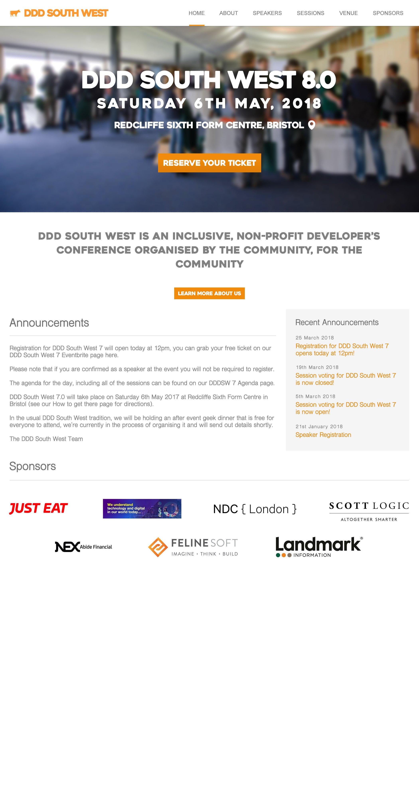

# DDD South West Website

New and improved website for the DDD South West conference.

## Running DDD South West locally

### Prerequisites

Before you can run the DDD South West website locally, you'll need to ensure the following prerequisites are met:

1. Ensure you have dotnet SDK v1 or above installed. You can do this using the `dotnet --info` command.

2. Ensure your `ASPNETCORE_ENVIRONMENT` environment variable is set to either `Development` or `development`. You can do this by running one of the following commands:

   **Windows:**  
   Command Prompt: `setx ASPNETCORE_ENVIRONMENT "Development"`  
   Powershell: `$env:ASPNETCORE_ENVIRONMENT = "Development"`

   **OS X:**  
   Run `export ASPNETCORE_ENVIRONMENT=Development` in your console.

3. Add `website` and `identityserver` to your host file, mapping them both to `localhost` for Windows, or `0.0.0.0` for OS X. This makes communication between the DDD South West website and Identity Server more reliable regardless of your OS.

4. The DDD South West website uses PostgreSQL as its data persistance engine so you'll need to have an instance running (either installed locally, remotely or via Docker) with the following development database credentials set:

   Database Name: `dddsouthwest`  
   Database Username: `dddsouthwest_user`  
   Database Password: `letmein`  

   The easiest way is to use the PostgresSQL Docker image via the below command:

   `docker run -d -p 5432:5432 -e POSTGRES_USER=dddsouthwest_user -e POSTGRES_PASSWORD=letmein -e POSTGRES_DB=dddsouthwest postgres:9.4`

   This command will download, run and create the database with the correct database user credentials set.

   Once PostgreSQL is running, you need to connect to the `dddsouthwest` database and use the `init.sql` file to seed the database schema and `demo_data.sql` to seed some demo data. This demo data includes an admin account with the following login credentials:

   Email: `admin@demo.com`  
   Password: `Letmein555`

### Running manually

Once the above prerequisites are met follow the steps below:

1. Clone contents of repo to your local disk
2. Run `dotnet restore` in solution root to restore the application(s) packages
3. Run `dotnet run` within the `src/DDDSouthWest.IdentityServer/` directory
4. Run `dotnet run` within the `src/DDDSouthWest.Website/` directory
5. Navigate to the website on `http://website:5002`

### Run from Docker

Once the above prerequisites are met follow the steps below:

1. Publish artifacts and create images by running `$ sh publish_docker.sh`
2. Run `docker-compose up` to launch
3. Connect to the PostgreSQL container and seed the database data using the contents of `demo_data.sql` as outlined in step 3 of the prerequisites.
4. Navigate to the website on `http://website:5002`

### Logging in as an admin

If you seed your database with the `demo_data.sql` as described in Step 3 of the prerequisites then you should be able to log in with the following demo user credentials:

Email: `admin@demo.com`  
Password: `Letmein555`

# Design

A preview of the front page:

